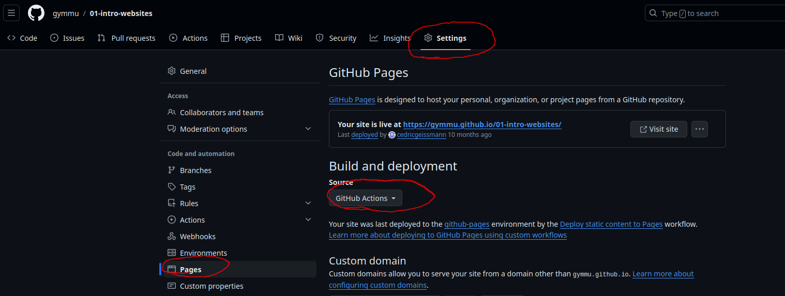

[](https://classroom.github.com/a/XrGgRtTk)

# Webseiten Projekt

In diesem Projekt stellen Sie sich selber über eine Webseite dar.

## Projekt einrichten

Sie können diesem Video folgen um das ganze Projekt aufzusetzen.

[](https://www.youtube.com/watch?v=e_Hr8u-CLYY)

## Webseite veröffentlichen

Die Webseite wird dann über Github-Pages automatisch veröffentlicht, und kann
mit Freunden und Familie geteilt werden. Damit Github-Pages auch funktioniert,
muss es zuerst aktiviert werden. Gehen Sie dafür auf Ihr Repository und dort
finden Sie unter `Settings > Pages` den Abschnitt `Build and Deployments` wo sie
die `Source` auf `Github Actions` umstellen müssen.



Jedes mal wenn Sie eine neue Version auf dem `main`-Branch hochladen, wird die
Webseite neu gebaut. Das kann jeweils ein paar Minuten dauern, ist dann aber
auch für andere über das Internet zugänglich. Um die eigene Webseite direkt zu
sehen, gibt es eine schnellere Lösung, mehr dazu im Abschnitt
[Entwicklungsumgebung aktivieren](#entwicklungsumgebung-aktivieren).

## Config anpassen

Damit auf der Webseite alles richtig dargestellt werden kann, muss die Datei
`vite.config.js` leicht angepasst werden. Der Wert für `base` muss so angepasst
werden, das der Name des Repositories darin steht.

### Zurück zur Hauptseite

Wenn Sie auf Ihre Hauptseite verlinken möchten, dann müssen Sie dafür den Wert
von `base` angeben. Also wenn Sie von einer Unterwebseite auf Ihre Hauptseite
möchten, dann müssen Sie dort den Wert von `base` beim Attribut `href=...` angeben.

### Weitere Unterseiten hinzufügen

Um weitere Unterwebseiten hinzuzufügen, müssen diese in `vite.config.js`
zusätzlich angegeben werden. Dafür können Sie den folgenden Block mit Ihrer
neuen Unterwebseite erweitern. Einfach den Eintrag von `hobbies` kopieren und anpassen.

```js
rollupOptions: {
    input: {
        main: resolve(__dirname, 'index.html'),
        hobbies: resolve(__dirname, 'pages/hobbies.html'),
    }
}
```

## Entwicklungsumgebung aktivieren

Damit wir eine Webseite korrekt anzeigen lassen können, und alle Bilder laden
können die dazu gehören, brauchen wir einen Webserver. Diesen können wir im
Container ganz einfach starten. Und zwar können wir ein Terminal öffnen, wenn
dies nicht bereits geöffnet wurde, und dort müssen wir nur noch den folgenden
Befehl eingeben.

```bash
npm run dev
```

Das startet und einen Webserver, über den wir unsere Seite dann anschauen
können. Wir können die Seite automatisch im Editor anzeigen lassen, oder Sie auf
einem separaten Browser öffnen. Dafür einfach die folgende URL öffnen:
[http://localhost:5174](http://localhost:5174). Nun sollten alle Änderungen die
wir im Code machen und **speichern** (`CRTL + S`) direkt auf der Webseite
ersichtlich sein. Manchmal muss die Webseite auch neu geladen werden, dazu kann
man bei den meisten Browsern `F5` drücken.

## Git konfigurieren

Um mit `Git` einen `Commit` zu machen, müssen Sie Ihren Namen und Ihre
E-Mail-Adresse angeben. Das können Sie entweder wie im Video beschrieben über
`git-Graph` machen, oder was fast einfacher ist, diese beiden Befehle in einem
neuen Terminal eingeben.

> **Namen angeben:**
>
> ```bash
> git config --global user.name "Vorname Nachname"
> ```

> **E-Mail-Adresse angeben:**
>
> ```bash
> git config --global user.email "e-nummer@edu.sbl.ch"
> ```

Wenn Sie diese beiden Schritte gemacht haben, dann können Sie in `Git` neue
`Commits` erstellen. Durch das `pushen` von diesen `Commits` wird Ihre Arbeit
bei Github gespeichert und auch auf der Webseite aktualisiert, obwohl das immer
ein paar Minuten dauern kann.

## Arbeit abgeben

Wenn Sie mit allen Aufgaben fertig sind, und alles was Sie gemacht haben zur
Versionskontrolle hinzugefügt haben, dann können Sie den `main`-Branch `pushen`.
Damit haben Sie Ihr Projekt dann abgegeben. Wenn Sie noch mehr Veränderungen
machen möchten, können Sie diese genau gleich hinzufügen und dann `pushen`. Das
wird dann automatisch zur neuen Abgabe.
